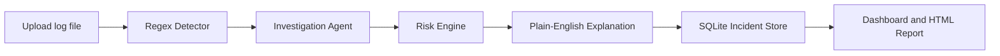

<div align="center">

# CyberGuardX

### Defensive AI SOC Assistance for Log Investigation

[](https://www.python.org/)
[](https://flask.palletsprojects.com/)
[](https://www.sqlite.org/)
[](#responsible-use)

CyberGuardX is a modular Flask application that turns security logs into prioritized,
plain-English incident investigations with risk scores, event correlation, timelines,
and HTML reports.

</div>

---

## Overview

Security logs are useful only when analysts can quickly understand what happened and
what needs attention. CyberGuardX analyzes uploaded `.log` and `.txt` files with
regex-first detection and a defensive Investigation Agent that correlates suspicious
authentication behavior.

### Highlights

| Capability | What CyberGuardX Provides |
| --- | --- |
| Log ingestion | Upload `.log` or `.txt` files from the browser |
| Detection | Failed logins, brute-force behavior, SQL injection indicators, and traversal / LFI indicators |
| Investigation Agent | Correlates repeated failures followed by a login success from the same IP |
| Risk engine | Assigns `Low`, `Medium`, `High`, or `Critical` severity |
| Analyst context | Extracts IP address, username, attempt count, success-after-failure status, and available timestamps |
| Reporting | Dashboard views and generated HTML incident reports |
| Persistence | SQLite-backed incident and timeline storage |

## Possible Account Compromise Detection

When multiple failed login attempts from one source IP are followed by a successful
login from that same IP, CyberGuardX generates a:

```text
Possible Account Compromise - Critical
```

The Investigation Agent retains:

- Source IP address
- Username, when present in the log
- Number of failed attempts
- Whether a success occurred after failure
- Timestamp evidence, when present
- A chronological incident timeline

## Detection Coverage

| Signal | Example Defensive Interpretation |
| --- | --- |
| Failed login attempt | Authentication failure retained for correlation |
| Brute-force pattern | Repeated failures from one IP exceed the detection threshold |
| Failed logins then success | Possible valid account access after suspicious attempts |
| SQL injection indicator | Web request contains common injection signatures |
| Directory traversal / LFI indicator | Request attempts access to unintended local paths |

## How It Works



## Application Structure

```text
CyberGuardX/
|-- app.py
|-- detector.py
|-- investigator.py
|-- risk_engine.py
|-- explanation_agent.py
|-- report_generator.py
|-- database.py
|-- requirements.txt
|-- uploads/
|-- reports/
|-- templates/
|   |-- index.html
|   |-- dashboard.html
|   `-- report.html
`-- static/
    `-- style.css
```

## Quick Start

### 1. Create a virtual environment

Windows:

```powershell
python -m venv .venv
.venv\Scripts\Activate.ps1
```

macOS / Linux:

```bash
python3 -m venv .venv
source .venv/bin/activate
```

### 2. Install dependencies

```bash
pip install -r requirements.txt
```

### 3. Start CyberGuardX

Optionally configure a secret key before running the app:

Windows PowerShell:

```powershell
$env:CYBERGUARDX_SECRET_KEY = "replace-with-a-random-secret"
```

macOS / Linux:

```bash
export CYBERGUARDX_SECRET_KEY="replace-with-a-random-secret"
```

```bash
python app.py
```

Open [http://127.0.0.1:5000](http://127.0.0.1:5000) in a browser.

## Using The Dashboard

1. Upload a defensive log file in `.log` or `.txt` format.
2. Review severity totals and identified findings.
3. Inspect the incident timeline for correlated login behavior.
4. Open the HTML report for a readable incident summary and recommended defensive actions.

Generated uploads, reports, and the SQLite incident database are kept local and are
excluded from version control by default.

## Technology

| Layer | Technology |
| --- | --- |
| Web application | Flask and Jinja templates |
| Analysis | Python regex detection and correlation logic |
| Storage | SQLite |
| User interface | HTML and CSS |
| Reports | Rendered HTML incident reports |

## Responsible Use

CyberGuardX is built strictly for defensive security monitoring and incident review.
It performs static log analysis only.

It does not execute exploits, automate attacks, deploy malware, steal credentials,
or perform offensive actions.

## Roadmap Ideas

- Configurable detection thresholds
- JSON and CSV log format support
- Exportable incident summaries
- Additional defensive detection signatures
- Authentication and role-based analyst views

---

<div align="center">

Built for blue teams, SOC learners, and defenders who need fast, readable log triage.

</div>
